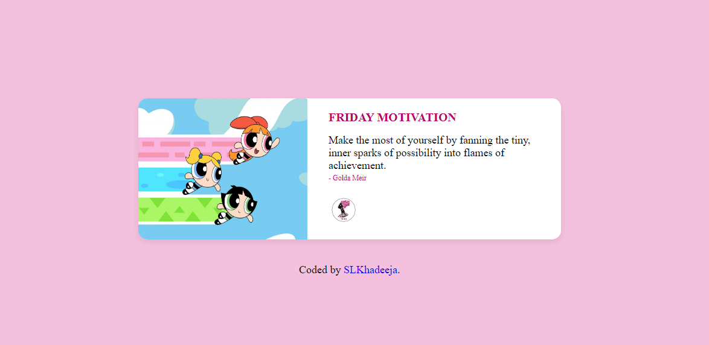

# Frontend Mentor - Article preview component - Solution

## Welcome! 👋

This is your first design conversion

This assesment is to improve your skills in a real-life workflow.

## The Assesment

Your challenge is to build out the quote card and get it looking as close to the design as possible.

Use all you've learnt so far and don't forget to also google.

Your users should be able to: 

- Click the profile picture to go to She Code Africa Minna twitter page

## Where to find everything

- The preview of the designs can be found inside the `/design` folder. You will find both a mobile and a desktop version of the design to work to. 

- The designs are in JPG static format. This will mean that you'll need to use your best judgment for styles such as `font-size`, `padding` and `margin`. This should help train your eye to perceive differences in spacings and sizes.

- You will find all the required assets in the `/images` folder. The assets are already optimized.
- There is also a `style-guide.md` file, which contains the information you'll need, such as color palette and fonts.

## Start your project

- Fork
- Clone
- Start working

## Deploying your project

- Open your github repository
- Go to settings
- Scroll down till you get to **GitHub Pages**
- Select master branch
- Click on save
- Try out your new site

## Sharing your solution

- Share the link to your repo and deployed site on Twitter and tag **@SCA_Minna** and **@paritieltd**